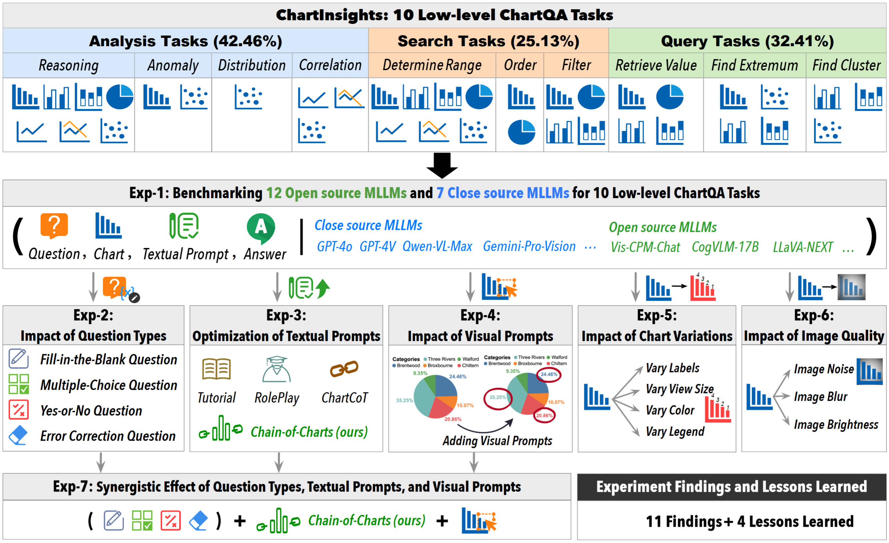
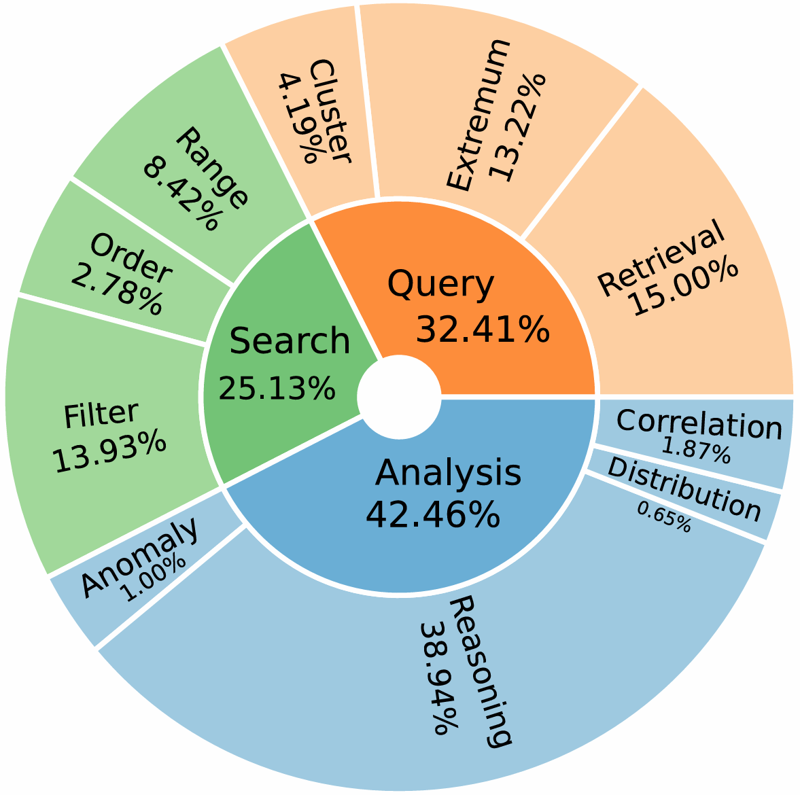
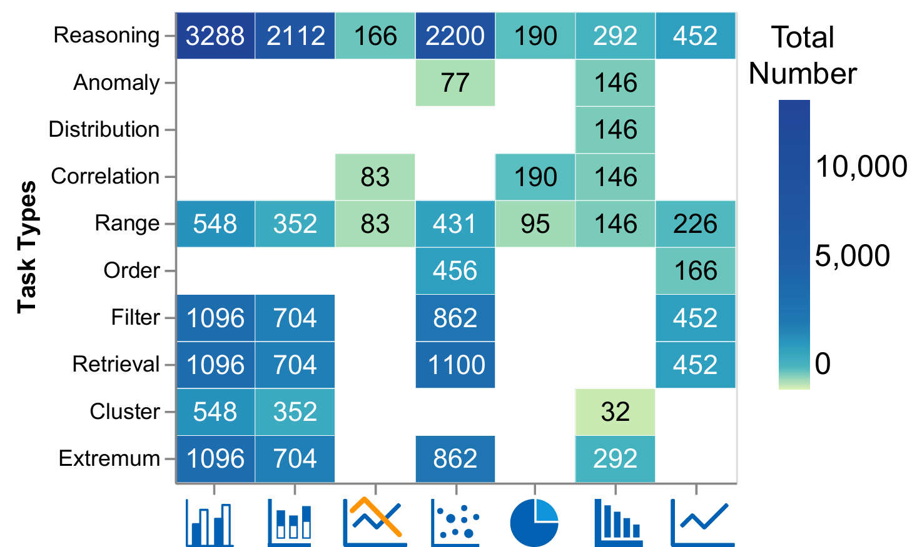
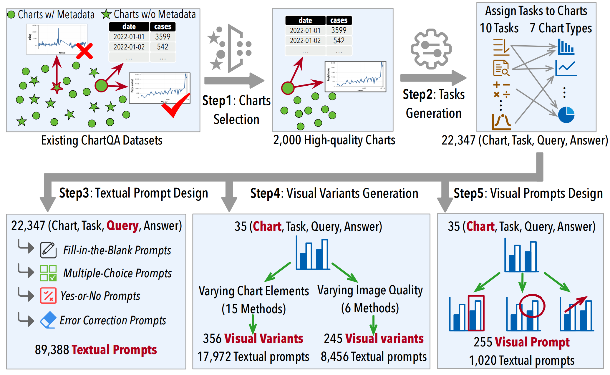
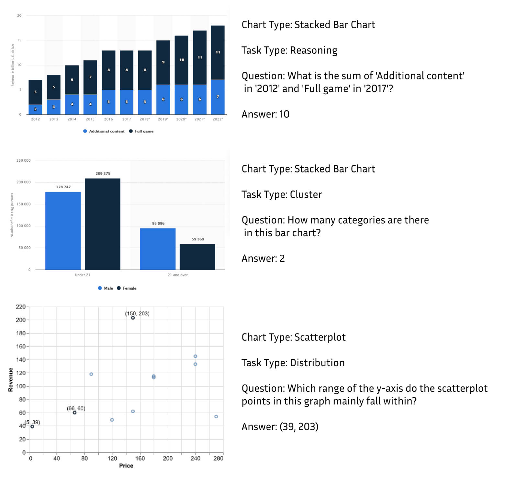

# ChartInsights: Evaluating Multimodal Large Language Models for Low-Level Chart Question Answering
- 🥳[About ChartsInsights](#about-chartsinsights)
    - [ChartInsights Overall & Evaluation Design](#chartinsights-overall--evaluation-design)
    - [Dataset Overview](#dataset-overview)
- 🎮[Dataset Construction](#dataset-construction)
    - [Pipeline for Dataset Construction](#pipeline-for-dataset-construction)
    - [Dataset Examples](#dataset-examples)
- 🧪[Evaluation Scripts on ChartInsights](#evaluation-scripts-on-chartinsights)
    - [Environment Setup](#environment-setup)
    - [A Quick Start for Overall Evaluations with ChartInsights](#a-quick-start-about-overall-evaluations-with-chartinsights)      
    - [Textual Prompt](#textual-prompt)
    - [Visual Prompt](#visual-prompt)
    - [Vary the Chart Elements](#vary-the-chart-elements)
    - [Vary the Chart Quality](#vary-the-chart-quality)
- 📊[Analysis of Evaluation Results with GPT-4o](#analysis-of-evaluation-results-with-gpt-4o)
    - [Overall Results Analysis](#overall-results-analysis)
    - [Textual Prompt Results Analysis](#textual-prompt-results-analysis)
    - [Visual Prompt Results Analysis](#visual-prompt-results-analysis)
    - [Chart Element Results Analysis](#chart-element-results-analysis)
    - [Chart Quality Results Analysis](#chart-quality-results-analysis)
- ⭐[Leaderboard](#leaderboard)
    - [Results of advanced MLLMs](#results-of-advanced-mllms)

## News
🎊Our Paper has been accepted by **EMNLP2024**!!

## About ChartInsights
### ChartInsights Overall & Evaluation Design
<div align=center>

    <p>Figure 1:  The Pipeline for Evaluating MLLMs with ChartInsights</p>
</div>
In this paper, we aim to systematically investigate the capabilities of GPT-4o in addressing 10 low-level data analysis tasks. Our study seeks to answer the following critical questions, shedding light on the potential of MLLMs in performing detailed, granular analyses.


__Q1__: Impact of Textual Prompt Variations. What is the impact of
different textual prompts on GPT-4o ’s output accuracy? This
question aims to assess the baseline performance and capabilities
of GPT-4o in different low-level tasks.

__Q2__: Impact of Visual Variations and Visual Prompts: How do
different visual prompts, such as alterations in color schemes,
layout configurations (e.g., aspect ratio), and image quality, affect
the performance of GPT-4o in low-level tasks?

__Q3__: Impact of Chain-of-Thoughts. Can we enhance basic textual
prompts in Q1 with a chain-of-thoughts like approach?

__Q4__: Synergistic Effect of Visual and Textual Prompts: Can the
combination of visual and textual prompts lead to enhanced performance in low-level ChartQA tasks with GPT-4o? This question explores the potential for achieving better results by integrating both types of prompts.


### Dataset Overview

ChartInsight contains 22,347 (chart, task, query, answer) samples across 7 chart types for 10 low-level data analysis tasks on charts. Our dataset includes 10 low-level data analysis tasks on charts, as shown in Figure 3. These tasks are well-defined by the visualization and visual analysis community. Among them, the proportion of 10 low-level tasks are in 3 groups, e.g. analysis, search, and query, the analysis task group is the largest, accounting for 42.46%. This task group examines the reasoning power of multi-modal large models on charts. Figure 4 shows the distribution of 10 low-level tasks and 7 chart types. 

<div align="center">
    <table>
        <tr>
            <td style="text-align: center;">
                
                <p>Figure 2: Task Distribution</p>
            </td>
            <td style="text-align: center;">
                
                <p>Figure 3: Low-level Tasks vs. Chart Types</p>
            </td>
        </tr>
    </table>
</div>

</div>

## Dataset Construction

### Pipeline for dataset construction
<div align=center>

    <p>Figure 4:  The Pipeline for ChartInsights Construction</p>

</div>

__Step1__: Candidate Charts Selection. In order to more comprehensively evaluate the ability of MLLMs on low-level data analysis tasks, and to conduct more detailed and extended experiments, the datasets (tabular data) and visualization charts we collected need to meet the following three requirements: First, these datasets should contain the original metadata of the charts. Second, the charts in these datasets should contain data labels. Third, these datasets should contain both simple and complex charts so that the difficulty of the charts is reasonable.

__Step2__: Low-Level Tasks Generation. Next, we design a set of 10 low-level tasks for the collected charts. We group the 10 low-level tasks into three categories, namely Analysis, Search, and Query. Finally, we have 22,347 (chart, task, question, answer).

__Step3__: Question Type Variation. In order to better explore the impact of different types of questions influence the interaction with MLLMs. We have designed 4 question types, namely Fill-in-the-Blank, Multiple-choice, Yes-or-No, and Error Correction questions.

__Step4__: In this step, we carried out three sub experiments in total. They are Varying the Chart Elements and Varying the Chart Quality. In the Varying the Chart Elements experiment, we totally modify our chart with 15 different methods. In Varying the Chart Quality experiment, we add 6 different noises into our charts. 

__Step5__: We consider three types of visual prompts.The first is to directly circle the content in the chart that is highly relevant to the question in handwriting, such as circling the values of the two elements mentioned in the reasoning question. The second method is regular shapes, which uses regular shapes (such as circles or rectangles) to label elements in the diagram. This makes 
it easier to use the size of a shape to imply the sequential relationship of elements. For example, use three circles of different sizes to correspond to the three values in the ordering task. The third way is special design. We design effective visual prompts tailored for different low-level tasks. For example, we use arrows to represent the monotonicity of the trend, for the correlation task.

### Dataset Examples


<div align=center>
    <p>Figure 5: Examples for ChartInsights</p>

</div>

## Environment Setup
Install required python libraries from requirements.txt:
```python
git clone https://github.com/ChartInsight/chartinsight.git
cd chartinsight
pip install -r requirement.txt
```
## Evaluation scripts on ChartInsights
### A Quick Start About Overall Evaluation on MLLMs With ChartInsights
Here we use GPT-4o as an example, before running the code below, you can get `overall_test_qa_pairs` and `overall_test_annotations` and `charts` in [Dataset/Overall Evalution](https://github.com/ChartInsight/chartinsight/tree/main/Dataset/Overall%20Evaluation/Charts). After you get all the files and charts, please list them in the following format:

```
├── test_qa_pairs.json
├── test_annotations.json
├── overall_evaluation.py
├── charts
    ├── 1.jpg
    ├── 2.jpg
    └── ...
```

`overall_evaluation.py`:
```python
import os
import json
from openai import OpenAI
import random
import base64
import requests
import time

api_key = 'YOUR API KEY'

## read relavant qa_pairs and annotations
with open("test_qa_pairs.json", 'r') as file:
    test_qa_pairs = json.load(file)
with open("test_annotations.json", 'r') as file:
    test_annotations = json.load(file)

def encode_image(image_path):
  with open(image_path, "rb") as image_file:
    return base64.b64encode(image_file.read()).decode('utf-8')

headers = {
  "Content-Type": "application/json",
  "Authorization": f"Bearer {api_key}"
}

def get_gpt_4o_reply(image_url, final_question):
    base64_image = encode_image(image_url)
    payload = {
      "model": "gpt-4o",
      "messages": [
        {
          "role": "user",
          "content": [
            {
              "type": "text",
              "text": final_question
            },
            {
              "type": "image_url",
              "image_url": {
                "url": f"data:image/png;base64,{base64_image}",
              },
            }
          ]
        }
      ],
      "max_tokens": 1000
    }

    response = requests.post("https://api.openai.com/v1/chat/completions", headers=headers, json=payload)
    gpt_4o_reply = response.json()['choices'][0]['message']
    return  gpt_4o_reply

## main function
start_length = 0
total_questions = 0
annotation_id = 0

for _, each_annotation in enumerate(test_annotations[annotation_id:]):
    total_charts = []
    begin = time.time()
    image_index = each_annotation['image']
    image_url = 'charts' + image_index
    image_type = each_annotation['type']
    index = each_annotation['id']

    for i, each_qa_pair in enumerate(test_qa_pairs[start_length:]):
        each_chart = {}
        each_chart['image_url'] = image_url
        each_chart['image_type'] = image_type
        task_category = each_qa_pair['type']
        each_chart['task_category'] = task_category
        print(each_qa_pair['QA_pairs'][0]['fill_the_blank'])
        if index == each_qa_pair['image_index']:
            start_length += 1
            total_questions += 4
            print(f"{index}, {task_category}")
            for each_question_format in each_qa_pair['QA_pairs']:
                each_key = list(each_question_format.keys())[0]
                final_question = each_question_format[each_key][0]
                annotation = each_question_format[each_key][1]
                gpt_4v_reply = get_gpt_4o_reply(image_url, final_question)
                each_chart[each_key + ' question'] = final_question
                each_chart[each_key + ' annotation'] = annotation
                each_chart[each_key + ' GPT-4v'] = gpt_4v_reply
            each_chart['start_length'] = start_length
            each_chart['annotation_id'] = annotation_id
            each_chart['pair_index'] = each_qa_pair['pair_index']
            total_charts.append(each_chart)
        else:
            break
    end = time.time()
    each_annotation_time = round(end - begin,2)
    annotation_id += 1
    print(f"{annotation_id}costs time{each_annotation_time}s")
```

### Textual Prompt
You can find the `textual_evaluation.py` code in [Scripts](https://github.com/ChartInsight/chartinsight/tree/main/Scripts). Before running the code, you can get `textural_test_qa_pairs` and `charts` in [Dataset/Textual Prompts](https://github.com/ChartInsight/chartinsight/tree/main/Dataset/Textual%20Prompt/Charts). and `tables` in [Dataset/Textual Prompts](https://github.com/ChartInsight/chartinsight/tree/main/Dataset/Textual%20Prompt/Tables). After you get all the files and charts, please list them in the following format:

```
├── textual_test_qa_pairs.json
├── textual_evaluation.py
├── charts
    ├── 1.jpg
    ├── 2.jpg
    └── ...
├── tables
    ├── 1.csv
    ├── 2.csv
    └── ...
```

### Visual Prompt
You can find the `visual_prompt_evaluation.py` code in [Scripts](https://github.com/ChartInsight/chartinsight/tree/main/Scripts). Before running the code, you can get `visual_prompt_test_qa_pairs` and and `charts` in [Dataset/Visual Prompt](https://github.com/ChartInsight/chartinsight/tree/main/Dataset/Visual%20Prompt/Charts). After you get all the files and charts, please list them in the following format:
```
├── visual_prompt_test_qa_pairs.json
├── visual_prompt_evaluation.py
├── charts
    ├── 1.jpg
    ├── 2.jpg
    └── ...
```

### Vary the Chart Elements
You can find the `varying_chart_element_evaluation.py` code in [Scripts](https://github.com/ChartInsight/chartinsight/tree/main/Scripts). Before running the code, you can get `varying_chart_element_test_qa_pairs.json` and `varying_chart_element_test_annotations.json` and `charts` in [Dataset/Vary Chart Element](https://github.com/ChartInsight/chartinsight/tree/main/Dataset/Vary%20Chart%20Element/Charts). After you get all the files and charts, please list them in the following format:

```
├── varying_chart_element_test_qa_pairs.json
├── varying_chart_element_test_annotations.json
├── varying_chart_element_evaluation.py
├── charts
    ├── 1.jpg
    ├── 2.jpg
    └── ...
```
### Vary the Chart Quality
You can find the `varying_chart_quality_evaluation.py` code in [Scripts](https://github.com/ChartInsight/chartinsight/tree/main/Scripts). Before running the code, you can get `varying_chart_qualityt_test_qa_pairs.json` and `varying_chart_quality_test_annotations.json` and `charts` in [Dataset/Vary Chart Element](https://github.com/ChartInsight/chartinsight/tree/main/Dataset/Vary%20Chart%20Element/Charts). After you get all the files and charts, please list them in the following format:

```
├── varying_chart_quality_test_qa_pairs.json
├── varying_chart_quality_test_annotations.json
├── varying_chart_quality_evaluation.py
├── charts
    ├── 1.jpg
    ├── 2.jpg
    └── ...
```

## Analysis of Evaluation Results with GPT-4o

### Overall Results Analysis
After you finish the overall experiments, you will get the results listed. And if you want to analyze those results, you can find relevant python files in [Evalution](https://github.com/ChartInsight/chartinsight/tree/main/Evaluation) and order them in the following format:
```
├── results
    ├── 1.json
    ├── 2.json
    └── ...
├── Check_Answers.py
├── Combine.py
├── Overall_Evaluation.py
```
__Step1__: Run the `Combine.py` to combine all the single JSON files into a combined JSON file.
```python
python Combine.py
```

After running the code above, you will get `total_results.json` in the `results` directory like this.
```
├── results
    ├── 1.json
    ├── 2.json
    ├── ......
    ├── total_results.json 
├── Check_Answers.py
├── Combine.py
├── Evaluation.py
```

__Step2__: Run the `Overall_Evaluation.py` to calculate the accuracy of GPT-4o.
```python
python Overall_Evaluation.py
```
__Step3__: After processing the above two steps, you will get 6 CSV files for results. You can check [Results/Accuracy_Table](https://github.com/ChartInsight/chartinsight/tree/main/Results/Accuracy_Table) as an example.
### Textual Prompt Results Analysis 
After you finish the Textual Prompt experiments, you will get the results listed. And if you want to analyze those results, you can find relevant python files in [Evalution](https://github.com/ChartInsight/chartinsight/tree/main/Evaluation) and order them in the following format:
```
├── results
    ├── 1.json
    ├── 2.json
    └── ...
├── Check_Answers.py
├── Combine.py
├── Textual_Prompt_Evaluation.py
```
Follow the three steps in `Overall Evaluation` and you will get 6 CSV files.
### Visual Prompt Results Analysis 
After you finish the Visual Prompt experiments, you will get the results listed. And if you want to analyze those results, you can find relevant python files in [Evalution](https://github.com/ChartInsight/chartinsight/tree/main/Evaluation) and order them in the following format:
```
├── results
    ├── 1.json
    ├── 2.json
    └── ...
├── Check_Answers.py
├── Combine.py
├── Visual_Prompt_Evaluation.py
```
Follow the three steps in `Overall Evaluation` and you will get 6 CSV files.
### Chart Element Results Analysis 
After you finish the Chart Element experiments, you will get the results listed. And if you want to analyze those results, you can find relevant Python files in [Evalution](https://github.com/ChartInsight/chartinsight/tree/main/Evaluation) and order them in the following format:
```
├── results
    ├── 1.json
    ├── 2.json
    └── ...
├── Check_Answers.py
├── Combine.py
├── Chart_Element_Evaluation.py
```
Follow the three steps in `Overall Evaluation` and you will get 6 CSV files.
### Chart Quality Results Analysis 
After you finish the Chart Quality experiments, you will get the results listed. And if you want to analyze those results, you can find relevant Python files in [Evalution](https://github.com/ChartInsight/chartinsight/tree/main/Evaluation) and order them in the following format:
```
├── results
    ├── 1.json
    ├── 2.json
    └── ...
├── Check_Answers.py
├── Combine.py
├── Image_Quality_Evaluation.py
```
Follow the three steps in `Overall Evaluation` and you will get 6 CSV files.
## Leaderboard
### Results of advanced MLLMs on ChartInsights
| Overall  | Model                | Reasoning | Anomaly | Distribution | Correlation | Range | Order | Filter | Retrieval | Extreme | Cluster |
|----------|----------------------|----------|-----------|---------|-------------|-------------|-------|-------|--------|-----------|--------|
| 🥇 69.17 | GPT-4o | 55.9 | 34.0 | 70.1 | 68.5 | 80.6 | 68.9 | 49.9 | 82.6 | 93.9 | 74.3 |
| 🥈56.13  | GPT-4V               | 35.17    | 19.53     | 53.43   | 59.62       | 70.04       | 41.92 | 44.32 | 67.59  | 88.66     | 72.87  |
| 🥉51.655 | qwen-vl-max          | 28.84    | 25.78     | 62.25   | 62.98       | 66.12       | 40.19 | 38.86 | 66.99  | 79.64     | 66.76  |
| 49.545   | Claude3(Haiku)       | 33.04    | 8.98      | 42.65   | 46.15       | 60.44       | 26.15 | 39.96 | 62.3   | 75.08     | 66.76  |
| 48.4375  | ChatGLM-4V           | 34.07    | 28.91     | 39.22   | 42.31       | 55.5        | 18.85 | 43.41 | 58.08  | 69.31     | 71.43  |
| 48.36    | Gemini_pro           | 25.6     | 30.08     | 45.59   | 58.65       | 75.26       | 32.88 | 30.06 | 60.37  | 80.88     | 55.26  |
| 42.595   | qwen-vl-plus         | 30.77    | 27.34     | 47.06   | 47.12       | 42.95       | 34.62 | 20.72 | 58.69  | 65.52     | 62.5   |
| 40.2325  | Sphinx-v2           | 30.02    | 28.91     | 37.75   | 36.06       | 25.78       | 23.46 | 36.74 | 49.72  | 66.31     | 45.31  |
| 38.51    | LLava-NEXT           | 30.6     | 7.42      | 26.47   | 37.98       | 29.5        | 33.27 | 23.39 | 53.49  | 59.81     | 52.27  |
| 33.295   | mPLUG-Owl2          | 30.99    | 26.95     | 29.41   | 35.34       | 28.39       | 22.5  | 40.25 | 30.89  | 41.1      | 27.27  |
| 33.425   | qwen-VL-chat         | 27.78    | 36.33     | 45.1    | 55.77       | 33.75       | 20    | 28.69 | 31.25  | 50.21     | 27.13  |
| 33.7525  | llava_vip            | 28.77    | 6.64      | 34.8    | 30.29       | 21.87       | 35.77 | 40.42 | 42.19  | 38.29     | 33.81  |
| 32.3875  | ChartAssistant       | 24.58    | 27.73     | 35.78   | 28.12       | 30.48       | 22.5  | 14.66 | 39.38  | 63.04     | 26.42  |
| 32.1875  | llava1.5             | 32.39    | 6.25      | 30.88   | 23.08       | 21.74       | 32.69 | 35.55 | 32.57  | 35.76     | 43.47  |
| 31.055   | OmniLMM-12B          | 24.67    | 19.92     | 26.96   | 34.86       | 35.7        | 28.27 | 29.96 | 33.01  | 39.94     | 33.1   |
| 33.015   | MiniCPM-v2           | 19.54    | 55.08     | 33.33   | 56.49       | 24.87       | 16.73 | 36.31 | 37.94  | 52.4      | 31.96  |
| 29.4325  | cogvlm               | 20.32    | 23.05     | 43.63   | 29.57       | 37.73       | 10.77 | 9.07  | 37.86  | 56.62     | 26.7   |
| 28.305   | Blip2                | 24.8     | 23.44     | 25      | 15.14       | 25.33       | 20.19 | 39.83 | 27.8   | 30.26     | 30.11  |
| 26.1875  | VisCPM               | 28.44    | 46.09     | 33.33   | 51.92       | 22.98       | 6.35  | 25.13 | 15.75  | 32        | 29.55  |

